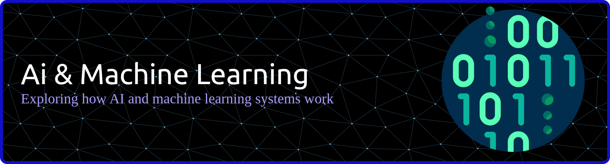

# AI & Machine Learning

A personal, hands-on journey into how AI and machine learning systems work,
from first-principles fundamentals to applied LLM systems. The focus is on
learning by building: implementing core ideas from scratch, studying their
trade-offs, and documenting the reasoning behind each solution.

## Current focus: Neural Networks: Zero to Hero

The main track of this repository is a deep, deliberate study of Andrej
Karpathy's [**Neural Networks: Zero to Hero**](https://karpathy.ai/zero-to-hero.html)
lecture series - building neural networks and language models from scratch in
PyTorch, starting from raw backpropagation and working up to a GPT-style
Transformer.

- [YouTube playlist](https://www.youtube.com/playlist?list=PLAqhIrjkxbuWI23v9cThsA9GvCAUhRvKZ)

All coursework, exercises, and notes for this series live in
[`topics/karpathy-neural_networks/`](topics/karpathy-neural_networks/), organized
lecture by lecture:

| # | Lecture | Topic |
| --- | --- | --- |
| 1 | [micrograd](topics/karpathy-neural_networks/01-micrograd/) | Backpropagation & autograd engine from scratch |
| 2 | [makemore (bigram)](topics/karpathy-neural_networks/02-makemore-bigram/) | Bigram character-level language model |
| 3 | [makemore (MLP)](topics/karpathy-neural_networks/03-makemore-mlp/) | MLP language model |
| 4 | [makemore (BatchNorm)](topics/karpathy-neural_networks/04-makemore-batchnorm/) | Activations, gradients, BatchNorm |
| 5 | [makemore (backprop ninja)](topics/karpathy-neural_networks/05-makemore-backprop-ninja/) | Manual backprop through the MLP |
| 6 | [makemore (WaveNet)](topics/karpathy-neural_networks/06-makemore-wavenet/) | WaveNet-style hierarchical model |
| 7 | [GPT](topics/karpathy-neural_networks/07-gpt/) | Building GPT from scratch |
| 8 | [Tokenizer](topics/karpathy-neural_networks/08-tokenizer/) | Building the GPT tokenizer |

Each lecture folder tracks its own progress, notes, and exercise solutions as
the course is worked through.

## Projects

Applied work that builds on these fundamentals:

| Project | Description | Topics |
| --- | --- | --- |
| [Call Me Maybe](projects/function_call/) | My first project working directly with LLMs: converts natural-language prompts into structured, typed function calls using a small local LLM (Qwen3-0.6B) and constrained decoding, guaranteeing 100% valid JSON output. | LLMs, tokenization, function calling, constrained decoding, structured output |

Each project contains its own documentation, setup instructions, design
decisions, and technical analysis.

## Repository structure

```text
AI_Machine_Learning/
├── topics/
│   └── karpathy-neural_networks/  # Neural Networks: Zero to Hero coursework
├── projects/
│   └── function_call/             # LLM function calling
├── tools/
│   └── Jupyter_Notebook/          # Jupyter notebook setup and utilities
├── src/                           # Shared assets (e.g. banner image)
└── README.md
```

## Approach

Work in this repository aims to:

- build important mechanisms instead of treating models as black boxes;
- explain algorithms and design decisions clearly;
- use reproducible environments and documented workflows;
- validate results with testing, static analysis, and measurable outcomes;
- connect theory to working implementations.

## Tech stack

Python, PyTorch, Transformers, NumPy, Matplotlib, Jupyter, Pydantic, and `uv`.

## Getting started

- To follow along with the course, see [`topics/karpathy-neural_networks/`](topics/karpathy-neural_networks/)
  for setup instructions and lecture-by-lecture progress.
- To explore applied work, open the [project index](#projects) and follow the
  setup and usage instructions in each project's README. Projects are
  self-contained and may have different dependencies or system requirements.

### GitHub Copilot cloud agent

This repository includes [`.github/workflows/copilot-setup-steps.yml`](.github/workflows/copilot-setup-steps.yml),
which preinstalls Python and this repository's dependencies before GitHub
Copilot's cloud agent starts working on an issue or pull request here. The
workflow only takes effect once it exists on the **default branch** — merge
it in, and it will run automatically for every future Copilot cloud agent
session on this repo. No manual activation step is needed beyond that; it can
also be run on demand from the repository's **Actions** tab.

## Resources

### Official documentation

- [Python documentation](https://docs.python.org/3/)
- [PyTorch documentation](https://docs.pytorch.org/docs/2.13/)
- [NumPy documentation](https://numpy.org/doc/stable/)
- [Matplotlib documentation](https://matplotlib.org/stable/)
- [Jupyter documentation](https://docs.jupyter.org/en/latest/)
- [Hugging Face Transformers documentation](https://huggingface.co/docs/transformers/)

### Courses and lectures

- [Andrej Karpathy - Neural Networks: Zero to Hero](https://karpathy.ai/zero-to-hero.html)
- [Neural Networks: Zero to Hero - YouTube playlist](https://www.youtube.com/playlist?list=PLAqhIrjkxbuWI23v9cThsA9GvCAUhRvKZ)
- [micrograd on GitHub](https://github.com/karpathy/micrograd)
- [makemore on GitHub](https://github.com/karpathy/makemore)
- [nn-zero-to-hero on GitHub](https://github.com/karpathy/nn-zero-to-hero)
